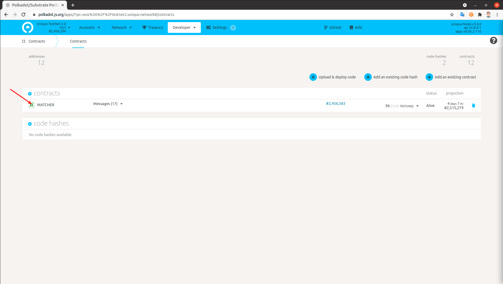

<div align="center">
    
</div>

[](https://polkadot.js.org)
[](https://unique.network/)


# Marketplace Deployment

Who is this document for:


> * Full stack engineers
> * IT administrators

In this tutorial we will install the marketplace locally on a computer or in a virtual machine with Ubuntu OS. The process of installing it in a production environment is the same plus your IT administrator will need to setup the infrastructure (such as domain name, hosting, firewall, nginx, and SSL certificates) so that the server that hosts the marketplace can be accessed by the users on the Internet, like Unique marketplace: [https://unqnft.io](https://unqnft.io).

## Prerequisites

>  * OS: Ubuntu 18.04 or 20.04
>  * docker CE 20.10 or up
>  * docker-compose 1.25 or up
>  * git
>  * Google Chrome Browser

## Step 1 - Create Escrow Account

An escrow account is a substate address that stores and manages the NFT and Kusama tokens put up for sale.
The easiest way to create an address is to use the extension [https://polkadot.js.org/extension/](https://polkadot.js.org/extension/). During the creation of the address, you will get 12-word mnemonic seed phrase, further called `ESCROW_SEED`. Do not share it with anybody because this phrase is all that’s needed to get access to the money and NFTs that are stored on this account.

## Step X - Get QTZ

In order to get the marketplace running, you’ll need some QTZ tokens. Now you can buy them on [MEXC Global](https://www.mexc.com/exchange/QTZ_USDT).


## Step X - Deploy Marketplace Smart Contract

`TODO`

## Step X - Create Sponsored Collection

You may create collection for your marketplace using [Minter](https://minter-quartz.unique.network). When you create your collection you may find `collection id`


For now, EVM Marketplace can only work with sponsored collections. You may set sponsorship using [polkadot.js.org/apps](https://polkadot.js.org/apps/?rpc=wss%3A%2F%2Fquartz.unique.network#/extrinsics) in 3 steps:

### 1. Set Collection Sponsor

- Choose `unique` - `setCollectionSponsor`
- Set the collectionId parameter to the id of the previously created collection
- Set the admin address created in step 2 as the new sponsor
- Click `Submit Transaction` and follow the instructions


### 2. Confirm Sponsorship

- Choose `unique` - `confirmSponsorship`
- Set the admin address created in step 2 as the transaction sender
- Set the collectionId parameter to the id of the previously created collection
- Click `Submit Transaction` and follow the instructions



### 3. Transfer QTZ to Sponsor

To sponsor EVM calls, you will need to transfer some QTZ to the ethereum mirror of your collection sponsor.

Use a built-in utility to get this address. For the script below, change `<COLLECTION_SPONSOR>` to the admin address from the Step 2, and run it.
```
docker exec -ti marketplace-api node sub_to_eth.js <COLLECTION_SPONSOR>
```

The result will look like this:

```
Substrate address: 5EC3pKTxGj8ciFp37giawUY1B4aWTAU7aRRK8eA1J8SKNRsf
Substrate address balance: 9748981663000000000000
Ethereum mirror: 0x5e125Fd6aA7D06dEEd31475BcE293999a48015B0
Ethereum mirror balance: 0
Substrate mirror of ethereum mirror: 5C9rxShqs4vA3dxvesNUfPHRinWfwSeQAkHmaWbVzki84g1y
Substrate mirror of ethereum mirror balance: 0
```

Copy the `Substrate mirror of ethereum mirror` address and send some QTZ there. Now all ethereum transactions will be sponsored from this address.

## Step X - Configure Marketplace

`TODO` envs

## Step X - Build and Run

Execute the following command in the terminal and wait for it to complete:

```
docker-compose up -d --build
```

## Step X - Enjoy


## License Information

`TODO`