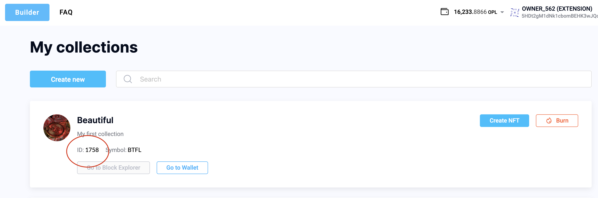

<div align="center">
    
</div>

[](https://polkadot.js.org)
[](https://unique.network/)


## Table of Contents

- [Marketplace Deployment - Getting Started Guide](#marketplace-deployment---getting-started-guide)
  - [Prerequisites](#prerequisites)
  - [Step 1 - Create An Escrow Account](#step-1---create-an-escrow-account)
    - [Start Configuring](#start-configuring)
  - [Step 2 - Get QTZ](#step-2---get-qtz)
  - [Step 3 - Deploy A Marketplace Smart Contract](#step-3---deploy-a-marketplace-smart-contract)
  - [Step 4 - Create A Sponsored Collection](#step-4---create-a-sponsored-collection)
    - [1. Set Collection Sponsor](#1-set-collection-sponsor)
    - [2. Confirm Sponsorship](#2-confirm-sponsorship)
    - [3. Transfer QTZ to Sponsors Ethereum Mirror](#3-transfer-qtz-to-sponsors-ethereum-mirror)
    - [4. Configure The Marketplace](#4-configure-the-marketplace)
  - [Step 5 - Check Configuration](#step-5---check-configuration)
  - [Step 6 - Add A Certificate to the Trusted List](#step-6-add-a-certificate-to-the-trusted-list)
  - [Step 7 - Build and Run](#step-7---build-and-run)
  - [Step 8 - Enjoy](#step-8---enjoy)
- [Advanced Guide](#advanced-guide)
  - [Frontend](#frontend)
  - [Backend](#backend)
    - [API](#api)
      - [Playgrounds](#playgrounds)
    - [Unique Escrow and Kusama Escrow](#unique-escrow-and-kusama-escrow)
    - [Postgres](#postgres)
    - [Nginx](#nginx)
  - [Sponsoring](#sponsoring)
  - [Using A Private Blockchain](#using-a-private-blockchain)
- [Chats and communities](#chats-and-communities)
  - [How To Update The Marketplace](#how-to-update-the-marketplace)
- [License Information](#license-information)


# Marketplace Deployment - Getting Started Guide

Who is this document for:


> * Full stack engineers
> * IT administrators

This tutorial shows the steps that need to be performed to carry out an install of the marketplace on a computer in a local environment or in a virtual machine with Ubuntu OS. The process of installing it in a production environment is identical, with the caveat that your IT administrator will need to setup the supporting infrastructure (such as a globally accessible domain name, hosting, firewall, nginx, and SSL certificates) so that the server that hosts the marketplace can be accessed by the users on the Internet. Visit [https://unqnft.io](https://unqnft.io) to experience an example of a self-hosted, globally accessible marketplace.

## Prerequisites

>  * OS: Ubuntu 18.04 or 20.04
>  * docker CE 20.10 or up
>  * docker-compose 1.25 or up
>  * git
>  * Google Chrome Browser

## Step 1 - Create An Escrow Account

An escrow account is a substrate address that manages the NFT and Kusama tokens put up for sale.
The easiest way to create such an address is to use the browser wallet extension available at [https://polkadot.js.org/extension/](https://polkadot.js.org/extension/). During the creation of the address, you will be provided with a 12-word mnemonic seed phrase, further referred to in the text as `ESCROW_SEED`. 
> :warning: Do not share the mnemonic phrase with anybody as this phrase is all that’s needed for someone to obtain access to the funds and NFTs that are stored on this account.

> :warning: Note down the address of the newly created account. It will be used in the upcoming steps and will be referred to as the `ESCROW_ADDRESS`.

### Start Configuring

From within the root directory create a fresh `.env` file and copy the entire contents of the `.env.sample` into it. Set the corresponding variable in the `.env` file to the `ESCROW_SEED` phrase we obtained above.

## Step 2 - Get QTZ

In order to get the marketplace running, the escrow address needs some QTZ tokens to be deposited into it. The minimum amount for launching a marketplace is around 80 QTZ. For a production setup, however, consider obtaining a bit more QTZ in advance – 1000 should cover all foreseeable expenses. At the time of writing of this tutorial QTZ can be obtained on the [MEXC Global](https://www.mexc.com/exchange/QTZ_USDT) exchange.


## Step 3 - Deploy A Marketplace Smart Contract

There are two ways to put a token up for sale – at a fixed price or through an auction. All fixed price asks get handled via a special smart contract which can be  explored in the `unique-marketplace-api` project on github - https://github.com/UniqueNetwork/unique-marketplace-api/tree/release/v1.0/blockchain.

A special utility is provided that is by far the easiest way to deploy a smart contract. Take note, there will need to be some QTZ in the escrow account to ensure a successful execution of the utility. The following script runs this utility and will create the ethereum address, deploy the smart contract, set the ethereum calls sponsor, and send it some QTZ:

```
docker-compose up -d backend
docker exec backend node dist/cli.js playground deploy_contract
```

After a short interval an operational summary will be output to the terminal:

```
...

SUMMARY:

CONTRACT_ETH_OWNER_SEED: '0x6d853337ab45b20aa5231c33979330e2806465fb4ab...'
CONTRACT_ADDRESS: '0x74C2d83b868f7E7B7C02B7D0b87C3532a06f392c'


Substrate mirror of contract address (for balances): 5F2NmgKvWHYZBTCoXVgkJay3sBEzpzmamU3ARmAgbf4tvx1C
Current contract balance: 40000000000000000000
```

The actual output content will differ to the one above and will correspond to the data set in the variables of the `.env` file.

> :warning: **Never share your `CONTRACT_ETH_OWNER_SEED` or commit it in the git repository** because this data is all that is needed for someone to obtain access to the funds and NFTs that are stored on the sale. Keep it in a safe and inaccessible place!

> :warning: Take note of the `Substrate mirror of contract address` and have it handy as later on all contract calls will be sponsored by it. Also, don't forget to deposit some QTZ balance to the account as well.

## Step 4 - Create A Sponsored Collection

The simplest way create collection for a marketplace is using the [Minter](https://minter-quartz.unique.network) tool. Note down the `collection id` during the creation process as it will come in handy later on in the steps that follow.



For now, the EVM Marketplace can only work with sponsored collections. A sponsorship can be set up using [polkadot.js.org/apps](https://polkadot.js.org/apps/?rpc=wss%3A%2F%2Fquartz.unique.network#/extrinsics) in 4 steps, as follows:

### 1. Set Collection Sponsor

- Choose `unique` - `setCollectionSponsor` method
- Set the collectionId parameter to the id of the newly created collection
- Provide [`ESCROW_ADDRESS`](#step-1---create-an-escrow-account) as the new sponsor
- Click `Submit Transaction` and follow the instructions

> :warning: Take note of the address and have it handy as later on all transfers to substrate addresses, including the escrow account, will be sponsored by it. Don't forget to make sure there is some QTZ in the account.

### 2. Confirm Sponsorship

- Choose `unique` - `confirmSponsorship` method
- Provide [`ESCROW_ADDRESS`](#step-1---create-an-escrow-account) as the transaction sender
- Set the collectionId parameter to the id of the newly created collection
- Click `Submit Transaction` and follow the instructions

### 3. Transfer QTZ to Sponsors Ethereum Mirror

To sponsor EVM calls, some QTZ need to be transferred to the ethereum mirror of the collection sponsor.

Use a built-in utility to obtain this address. In the script below, change `<COLLECTION_SPONSOR>` to the [`ESCROW_ADDRESS`](#step-1---create-an-escrow-account), and run it.
```
docker exec -ti backend node sub_to_eth.js <COLLECTION_SPONSOR>
```

The result should look similar to this output:

```
Substrate address: 5EC3pKTxGj8ciFp37giawUY1B4aWTAU7aRRK8eA1J8SKNRsf
Substrate address balance: 9748981663000000000000
Ethereum mirror: 0x5e125Fd6aA7D06dEEd31475BcE293999a48015B0
Ethereum mirror balance: 0
Substrate mirror of ethereum mirror: 5C9rxShqs4vA3dxvesNUfPHRinWfwSeQAkHmaWbVzki84g1y
Substrate mirror of ethereum mirror balance: 0
```

Copy the `Substrate mirror of ethereum mirror` address and send some QTZ there. From here on, all ethereum transactions will be sponsored from this address.

> :warning: Note down this address, as later on all transfers to the ethereum addresses, including the contact address, will be sponsored by it. Have some a small amount of QTZ on balance at this address.

### 4. Configure The Marketplace

Set the list of ids of the created collections in the `.env` file:

```
UNIQUE_COLLECTION_IDS='3,4,5'
```

## Step 5 - Check Configuration

There is a handy utility that will run a check to test if everything is set properly up. To use it execute the script below:

```
docker-compose up -d backend
docker exec backend node dist/cli.js playground check_config
```

If everything is configured correctly, a bunch of green checkboxes will get ticked in the console, as shown below:

```
Checking CONTRACT_ADDRESS
[v] Contract address valid: 0x3c9931eA16D1048D7e22F3630844EC25eFD6B26f
[v] Contract balance is 40 tokens (40000000000000000000)
[v] Contract self-sponsoring is enabled
[v] Rate limit is zero blocks
[v] Contract owner valid, owner address: 0x3CA7393F1C8Df383c0f35d7BC1a5a938168c7d4b
Contract owner balance is 4 tokens (4492008910681246304)

Checking UNIQUE_COLLECTION_IDS
Collection #3
  [v] Sponsor is confirmed, yGGxcBQUCymdHtjQUdJDiXDTTXuonGv8HyRJiH5YDUcmfUyhr
  [v] Sponsor has 999999999948 tokens (999999999948126753000000000000) on its substrate wallet
  [v] Sponsor has 1000000000 tokens (1000000000000000000000000000) on its ethereum wallet
  [v] Transfer timeout is zero blocks
  [v] Approve timeout is zero blocks
```

At this point, the setup is almost done.

## Step 6 Add A Certificate to the Trusted List

To simplify the process of setting the marketplace up, a self-signed ssl certificate is provided for a test implementation. It is located in the `nginx/ssl` folder. It should never be used in a production context, but for a test environment it provides a convenient, workable solution. You will need to add this certificate to your list of trusted certificates. Otherwise, there is always the option to generate a personal domain ssl certificate via an on-line ssl certificate issuing authority.

## Step 7 - Build and Run

Execute the following command in the terminal and wait for it to complete:

```
docker-compose up -d
```

## Step 8 - Enjoy

Open [https://localhost](http://localhost:80) in your Chrome browser. On first launch a Polkadot{.js}’s request to authorize the website will pop-up. Approve this request.

The marketplace will connect to the blockchain and the local backend and will display the empty Market page. It is now ready to rumble. 

# Advanced Guide

## Frontend

[GitHub repo and docs](https://github.com/UniqueNetwork/unique-marketplace-frontend#readme) 

If you want to customize the UI and still be able to receive updates from team Unique – follow this [instruction](https://github.com/UniqueNetwork/unique-marketplace-api#readme).

## Backend

[GitHub repo and docs](https://github.com/UniqueNetwork/unique-marketplace-api/tree/release/v1.1.0#readme).

### API

#### Playgrounds

There are some tools that you may come in handy when configuring and exploiting the marketplace that are a part of the marketplace API. In the process of setting up the marketplace some of them were used in the [deploying a smart contract](#step-3---deploy-a-marketplace-smart-contract) and [checkeing the marketplace configuration](#step-5---check-configuration) steps.

All the information about these playgrounds utilities can be found in the marketplace [docs](https://github.com/UniqueNetwork/unique-marketplace-api/tree/release/v1.1.0#readme). Feel free to dive into the deep end of the pool.

### Unique Escrow and Kusama Escrow

These two crowlers are part of unique-marketplace-api project, and do a simple thing - subscribe to receive new blocks of the corresponding blockchain and look for events related to the marketplace such as the transfer of NFTs or Kusama tokens to the account address.

### Postgres

Postgres can be configured by changing the environment variables inside the `.env` file. The default settings are already provided in the `.env.sample` file.

### Nginx

...


## Sponsoring

[Main article](https://docs.unique.network/unique-and-quartz-wiki/build/reference/sponsoring-and-fees)

> The Unique Network allows sponsoring of user transactions for NFT, Fungible, and Refungible collections and smart contracts. When a collection (or a smart contract) is sponsored, the only thing the sponsored users need to have is a Unique wallet and an address. There is no requirement to have any QTZ or UNQ on balance in the wallet on their part. This feature removes the extra friction for the end user and creates nice, flawless user experience for the brand new user in the unique chain.

However, it is always worth remembering that the sponsor accounts should have a balance of QTZ in order to be able provide for the sponsored user transactions.

The full list of appearance of the marketplace sponsors:

- Contract sponsor. In [step 3](#step-3---deploy-a-marketplace-smart-contract)
- Collection sponsor for Substrate transfers. Assigned in [step 4.1](#1-set-collection-sponsor)
- Collection sponsor for Ethereum transfers. An ethereum mirror of s Substrate collection sponsor. QTZ was sent to it in [step 4.3](#1-set-collection-sponsor)


## Using A Private Blockchain

For testing purposes it makes sense to launch a local version of a Quartz blockchain. To do this use the [image from docker hub](https://hub.docker.com/r/uniquenetwork/quartz-node-private).

# Chats and communities

You can find all developer related news in our \#dev-announcements channel on Discord: [https://discord.gg/hbhYeJfT](https://discord.gg/hbhYeJfT)

If you have questions or you need assistance feel free to reach out to our friendly team in the Unique Network Developer Support Telegram channel: [https://t.me/unique_network_support](https://t.me/unique_network_support).

## How To Update The Marketplace

...

# License Information

Copyright 2021, Unique Network, Usetech Professional

Licensed under the Apache License, Version 2.0 (the "License");
you may not use this file except in compliance with the License.
You may obtain a copy of the License at

http://www.apache.org/licenses/LICENSE-2.0

Unless required by applicable law or agreed to in writing, software
distributed under the License is distributed on an "AS IS" BASIS,
WITHOUT WARRANTIES OR CONDITIONS OF ANY KIND, either express or implied.
See the License for the specific language governing permissions and
limitations under the License.
