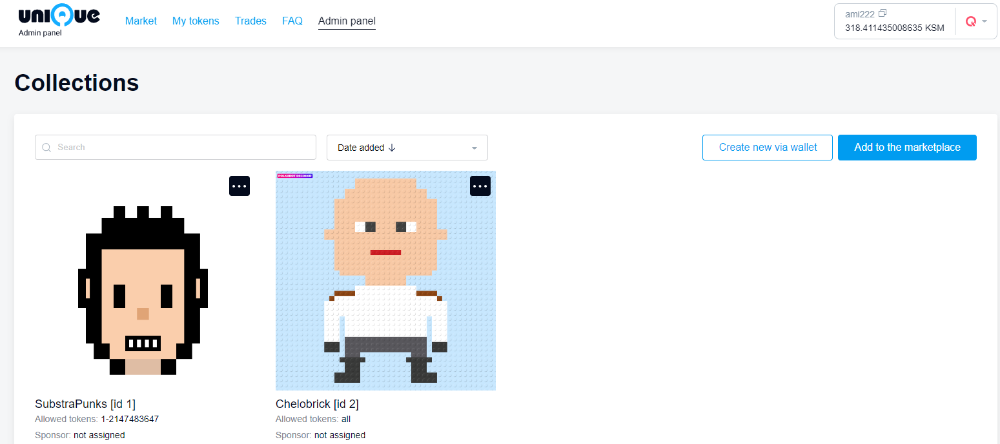

<div align="center">
    
</div>

[](https://polkadot.js.org)
[](https://unique.network/)


<!-- 
 -->


## Table of Contents

- [Marketplace Deployment - Getting Started Guide](#marketplace-deployment---getting-started-guide)
  - [Prerequisites](#prerequisites)
  - [Step 1 - Create Escrow and Auction Accounts](#step-1---create-escrow-and-auction-accounts)
    - [Start Configuring](#start-configuring)
  - [Step 2 - Get QTZ](#step-2---get-qtz)
  - [Step 3 - Deploy a Marketplace Smart Contract](#step-3---deploy-a-marketplace-smart-contract)
  - [Step 4 - Create a Sponsored Collection](#step-4---create-a-sponsored-collection)
    - [1. Set Collection Sponsor](#1-set-collection-sponsor)
    - [2. Confirm Sponsorship](#2-confirm-sponsorship)
    - [3. Set a Transfer Sponsorship Limit](#3-set-a-transfer-sponsorship-limit)
  - [Step 5 - Check Configuration](#step-5---check-configuration)
  - [Step 6 - Add a Certificate to the Trusted List](#step-6---add-a-certificate-to-the-trusted-list)
  - [Step 7 - Build and Run](#step-7---build-and-run)
  - [Step 8 - Enjoy](#step-8---enjoy)
- [Advanced Guide](#advanced-guide)
  - [Frontend](#frontend)
  - [Backend](#backend)
    - [API](#api)
      - [Playgrounds](#playgrounds)
    - [Unique Escrow and Kusama Escrow](#unique-escrow-and-kusama-escrow)
    - [Postgres](#postgres)
    - [Nginx](#nginx)
  - [Version Control and Updates](#version-control-and-updates)
  - [Sponsoring](#sponsoring)
  - [Using a Private Blockchain](#using-a-private-blockchain)
  - [Primary Marketplace](#primary-marketplace)
- [Chats and Communities](#chats-and-communities)
- [License Information](#license-information)


# Marketplace Deployment - Getting Started Guide

Who is this document for:


> * Full stack engineers
> * IT administrators

This tutorial shows the steps that need to be performed to carry out an install of the marketplace on a computer in a local environment or in a virtual machine with Ubuntu OS. The process of installing it in a production environment is identical, with the caveat that your IT administrator will need to setup the supporting infrastructure (such as a globally accessible domain name, hosting, firewall, nginx, and SSL certificates) so that the server that hosts the marketplace can be accessed by the users on the Internet. Visit [https://unqnft.io](https://unqnft.io) to experience an example of a self-hosted, globally accessible marketplace.

## Prerequisites

>  * OS: Ubuntu 18.04 or 20.04
>  * docker CE 20.10 or up
>  * git
>  * Google Chrome Browser

## Step 1 - Create Escrow and Auction Accounts

An escrow account is a substrate address that manages the NFT and Kusama tokens put up for sale.
The easiest way to create such an address is to use the browser wallet extension available at [https://polkadot.js.org/extension/](https://polkadot.js.org/extension/). During the creation of the address, you will be provided with a 12-word mnemonic seed phrase, further referred to in the text as `ESCROW_SEED`.

Follow the same steps again to get `AUCTION_SEED`

> :warning: Be sure to make sure that `ESCROW_SEED` and `AUCTION_SEED` have different values, otherwise the market will not be able to work correctly, and it will create vulnerabilities 

> :warning: Do not share the mnemonic phrase with anybody as this phrase is all that’s needed for someone to obtain access to the funds and NFTs that are stored on this account.

> :warning: Note down the address of the newly created accounts. It will be used in the upcoming steps and will be referred to as the `ESCROW_ADDRESS` and `AUCTION_ADDRESS`.

### Start Configuring

From within the root directory create a fresh `.env` file and copy the entire contents of the `.env.sample` into it. Set the corresponding variable in the `.env` file to the `ESCROW_SEED` and `AUCTION_SEED` phrases we obtained above.

## Step 2 - Get QTZ

In order to get the marketplace running, the `ESCROW_ADDRESS` needs some QTZ tokens to be deposited into it. The minimum amount for launching a marketplace is around 60 QTZ (~50 QTZ for contract deployment, and ~10 QTZ for creating collection, and 50 NFTs). For a production setup, however, consider obtaining a bit more QTZ in advance – 1000 should cover all foreseeable expenses. At the time of writing of this tutorial QTZ can be obtained on the [MEXC Global](https://www.mexc.com/exchange/QTZ_USDT) exchange.


## Step 3 - Deploy a Marketplace Smart Contract

There are two ways to put a token up for sale – at a fixed price or through an auction. All fixed price asks get handled via a special smart contract which can be  explored in the `unique-marketplace-api` project on github - https://github.com/UniqueNetwork/unique-marketplace-api/tree/master/blockchain.

A special utility is provided that is by far the easiest way to deploy a smart contract. 

> :warning: Take note, there will need to be ~50 QTZ in the `ESCROW_ADDRESS` to ensure a successful execution of the utility. Also the `ESCROW_SEED` environment variable must be set in `.env` file. 
 
The following script runs this utility and will create the ethereum address, deploy the smart contract, set the ethereum calls sponsor, and send it 40 QTZ:

```
docker compose up -d backend
docker exec backend node dist/cli.js playground deploy_contract
```

After a short interval an operational summary will be output to the terminal:

```
...

SUMMARY:

CONTRACT_ETH_OWNER_SEED: '0x6d853337ab45b20aa5231c33979330e2806465fb4ab...'
CONTRACT_ADDRESS: '0x74C2d83b868f7E7B7C02B7D0b87C3532a06f392c'


Substrate mirror of contract address (for balances): 5F2NmgKvWHYZBTCoXVgkJay3sBEzpzmamU3ARmAgbf4tvx1C
Current contract balance: 40000000000000000000
```
> NOTE: please save carefully substrate mirror of contract address because it is used for replenishment the balance.

The actual output content will differ to the one above and will correspond to the data set in the variables of the `.env` file.

> :warning: **Never share your `CONTRACT_ETH_OWNER_SEED` or commit it in the git repository** because this data is all that is needed for someone to obtain access to the funds and NFTs that are stored on the sale. Keep it in a safe and inaccessible place!

> :warning: Take note of the `Substrate mirror of contract address` and have it handy as later on all contract calls will be sponsored by it. Also, don't forget to deposit some QTZ balance to the account as well.

## Step 4 - Create a Sponsored Collection

The simplest way create collection for a marketplace is using the [Minter](https://minter-quartz.unique.network) tool. Note down the `collection id` during the creation process as it will come in handy later on in the steps that follow. You will only need about 10 QTZ to create a collection and 50 NFTs.


Set the list of ids of the created collections in the `.env` file:

```
UNIQUE_COLLECTION_IDS='3,4,5'
```

The marketplace can operate without sponsored collections. However, in this case, your users will be forced to pay a commission of the Quartz network. For a smoother experience, you may sponsor transfers of nft tokens made by your users. A sponsorship can be set up using [polkadot.js.org/apps](https://polkadot.js.org/apps/?rpc=wss%3A%2F%2Fquartz.unique.network#/extrinsics) in 2 steps, as follows:

### 1. Set Collection Sponsor

- Choose `unique` - `setCollectionSponsor` method
- Set the collectionId parameter to the id of the newly created collection
- Provide [`ESCROW_ADDRESS`](#step-1---create-escrow-and-auction-accounts) as the new sponsor
- Click `Submit Transaction` and follow the instructions

### 2. Confirm Sponsorship

- Choose `unique` - `confirmSponsorship` method
- Provide [`ESCROW_ADDRESS`](#step-1---create-escrow-and-auction-accounts) as the transaction sender
- Set the collectionId parameter to the id of the newly created collection
- Click `Submit Transaction` and follow the instructions

> :warning: Take note of the sponsor address and have it handy as later on all transfers will be sponsored by it. Don't forget to make sure there is some QTZ in the account.

### 3. Set a Transfer Sponsorship Limit

- Choose `unique` - `setCollectionLimits` method
- Provide [`ESCROW_ADDRESS`](#step-1---create-escrow-and-auction-accounts) as the transaction sender
- Set the `sponsorTransferTimeout` parameter to `0`
- Click `Submit Transaction` and follow the instructions


## Step 5 - Check Configuration

There is a handy utility that will run a check to test if everything is set properly up. To use it execute the script below:

```
docker compose up -d backend
docker exec backend node dist/cli.js playground check_config
```

If everything is configured correctly, a bunch of green checkboxes will get ticked in the console, as shown below:

```
Checking CONTRACT_ADDRESS
[v] Contract address valid: 0x3c9931eA16D1048D7e22F3630844EC25eFD6B26f
[v] Contract balance is 40 tokens (40000000000000000000)
[v] Contract self-sponsoring is enabled
[v] Rate limit is zero blocks
[v] Contract owner valid, owner address: 0x3CA7393F1C8Df383c0f35d7BC1a5a938168c7d4b
Contract owner balance is 4 tokens (4492008910681246304)

Checking UNIQUE_COLLECTION_IDS
Collection #3
  [v] Sponsor is confirmed, yGGxcBQUCymdHtjQUdJDiXDTTXuonGv8HyRJiH5YDUcmfUyhr
  [v] Sponsor has 999999999948 tokens (999999999948126753000000000000) on its wallet
  [v] Transfer timeout is zero blocks
  [v] Approve timeout is zero blocks
```

At this point, the setup is almost done.

## Step 6 - Add a Certificate to the Trusted List

To simplify the process of setting the marketplace up, a self-signed ssl certificate is provided for a test implementation. It is located in the `nginx/ssl` folder. It should never be used in a production context, but for a test environment it provides a convenient, workable solution. Create a copy of `certificate.sample.crt`, name it `certificate.crt`. Also rename `private.sample.key`, call it `private.key`. You will need to add this newly created certificate to your list of trusted certificates. Otherwise, there is always the option to generate a personal domain ssl certificate via an on-line ssl certificate issuing authority.


## Step 7 - Build and Run

Execute the following command in the terminal and wait for it to complete:

```
docker compose up -d
```

## Step 8 - Enjoy

Open [https://localhost](http://localhost:80) in your Chrome browser. On first launch a Polkadot{.js}’s request to authorize the website will pop-up. Approve this request.

The marketplace will connect to the blockchain and the local backend and will display the empty Market page. It is now ready to rumble. 

# Advanced Guide

## Frontend

[GitHub repo and docs](https://github.com/UniqueNetwork/unique-marketplace-frontend#readme) 

Unique marketplace provides a simple solution for customizing UI. Just try it – feel free to change some styles or layout in `static` folder.

If you want to customize the UI and still be able to receive updates from team Unique – follow this [instruction](https://github.com/UniqueNetwork/unique-marketplace-api#readme).

## Backend

[GitHub repo and docs](https://github.com/UniqueNetwork/unique-marketplace-api/tree/release/v1.1.0#readme).

### API

#### Playgrounds

There are some tools that you may come in handy when configuring and exploiting the marketplace that are a part of the marketplace API. In the process of setting up the marketplace some of them were used in the [deploying a smart contract](#step-3---deploy-a-marketplace-smart-contract) and [checkeing the marketplace configuration](#step-5---check-configuration) steps.

All the information about these playgrounds utilities can be found in the marketplace [docs](https://github.com/UniqueNetwork/unique-marketplace-api/tree/release/v1.1.0#readme). Feel free to dive into the deep end of the pool.

### Unique Escrow and Kusama Escrow

These two crowlers are part of unique-marketplace-api project, and do a simple thing - subscribe to receive new blocks of the corresponding blockchain and look for events related to the marketplace such as the transfer of NFTs or Kusama tokens to the escrow address.

### Postgres

Postgres can be configured by changing the environment variables inside the `.env` file. The default settings are already provided in the `.env.sample` file.

### Nginx

...

## Version Control and Updates

To avoid incompatibility, you should always use the same tag for [frontend](https://hub.docker.com/r/uniquenetwork/marketplace-frontend) and [backend](https://hub.docker.com/r/uniquenetwork/marketplace-backend) images from dockerhub. For this purposes we included `MARKET_VERSION` environment variable in `.env.sample`, which is used inside `docker-compose.yml` file.

By default we specified the `latest` tag. Nevertheless, for production it is advisable to fix the versions by specifying for the `MARKET_VERSION` variable the tag on which the market has already been tested by you, and update as needed manually.

## Sponsoring

[Main article](https://docs.unique.network/unique-and-quartz-wiki/build/reference/sponsoring-and-fees)

> The Unique Network allows sponsoring of user transactions for NFT, Fungible, and Refungible collections and smart contracts. When a collection (or a smart contract) is sponsored, the only thing the sponsored users need to have is a Unique wallet and an address. There is no requirement to have any QTZ or UNQ on balance in the wallet on their part. This feature removes the extra friction for the end user and creates a nice, flawless user experience for the brand new user in the unique chain.

However, it is always worth remembering that the sponsor accounts should have a balance of QTZ in order to be able provide for the sponsored user transactions.

The full list of appearance of the marketplace sponsors:

- Contract owner. In [step 3](#step-3---deploy-a-marketplace-smart-contract)
- Сontract itself, also created in [step 3](#step-3---deploy-a-marketplace-smart-contract)
- Sponsor of collection tokens transfers. Assigned in [step 4.1](#1-set-collection-sponsor)


## Using a Private Blockchain

For testing purposes it makes sense to launch a local version of a Quartz blockchain. To do this use the [image from docker hub](https://hub.docker.com/r/uniquenetwork/quartz-node-private).

## Primary Marketplace

There are two possible states of the marketplace **Secondary** and **Primary**. 

When the marketplace is switched to the **Primary**:
- Only administrators can put up tokens for sale. This is applicable for both - fixed price and auction selling methods; 
- Other users cannot put up tokens for sale. The 'Sell' button is not available on the token pages;
- At the same time 'Transfer' button is available for all users in any state of the marketplace.


When the marketplace is **Secondary**, all the users can put up tokens for sale. Both 'Sell' and 'Transfer' buttons are available.


There are **three environment variables** under the 'Market type configuration' section inside the `.env` file.

1. The type of the marketplace can be configured by changing `MARKET_TYPE` variable. By default it is set as 'secondary'. Update the value as 'primary' to enable the appropriate type.

2. `MAINSALE_SEED` variable is a substrate address of the account which is granted:
- to perform mass placement of tokens for sale with fixed price;
- to perform mass placement of tokens for auction sale;
- to perform the cancellation of all offers and auctions of the secondary marketplace;

**PLEASE NOTICE**

+ There can only be one `MAINSALE_SEED` address for the marketplace;
+ There is no strict rule to add `MAINSALE_SEED` address for the marketplace;
+ `MAINSALE_SEED` address must be added to the administrators list. However if you miss this step, `MAINSALE_SEED` address will be automatically added to the `ADMIN_LIST` just after running the marketplace.

3. `ADMIN_LIST` is an array of substrate adresses of all the administrators including `MAINSALE_SEED` when it exists.
> Add Substrate addresses of marketplace administrators separated by commas. Works since version marketplace API v1.6.0

**WARNING!!!**
Make sure that `MAINSALE_SEED` has different from `ESCROW_SEED` and `AUCTION_SEED` value, otherwise the marketplace will not be able to work correctly and it will create vulnerabilities.

It is supposed that type is set when deploying the marketplace and there are no other collections added.
However if the owner of a secondary marketplace switches it to the primary type when there are lots of offers created the following approach is used:

Auctions:
   - all auctions are stopped. The last high bid wins the auction;
   - the token is given to the winner;
   - the losers are refunded their bid amount.

Offers:  
   - the offer is transferred to the status `removed_by_admin`;
   - the owner of the offer can remove the token from sale in the 'My tokens' section.

**ADMIN PANEL**

For all accounts added to the `ADMIN_LIST` variable access to the **Admin panel** of the marketplace is provided regardless of it's state.

The main goal of the **Admin panel** is adding collections for sale and enabling collection sponsoring. You can find additional information in the [create a sponsored collection](#step-4---create-a-sponsored-collection) and [sponsoring](#sponsoring) sections.

To log into the **Admin panel** do the following:
- Open your browser and navigate to [https://localhost/administration/login](http://localhost:80/administration/login). You will be prompted to authorize with Polkadot{.js}’s request; 
- Sign the message in the extension to authorize. 

You will navigate to the **Admin panel**.



**Admin panel** provides a number of main options:
1. Add collections for sale;
2. Remove collections from sale;
3. Accept sponsorship;
4. Reject sponsorship;
5. Listing particular tokens of a collection to the marketplace (or all the tokens). 

Additional functionalities are available as well:
+ Navigate to the 'Scan' page of the collection;
+ Navigate to the wallet where the user can create a new collection;
+ Search by collection ID or Name;
+ Sorting collections.

In **Admin panel** when you are logged in under `MAINSALE_SEED` account there is no way to perform mass placement of tokens for sale or mass cancellation.

For such purposes you can use the marketplace Swagger Api:
- Open your browser and navigate to [https://localhost/api/docs](http://localhost:5000/api/docs);
- Use appropriate methods 
  - `/api/admin/login` to authorize;
  - `/api/admin/collections/fixprice` for mass fixprice sale;
  - `/api/admin/collections/auction` for mass auction sale;
  - `/api/admin/mass-cancel` to perform the cancellation of all offers and auctions.

Note that `MAINSALE_SEED` has to be the owner of the tokens supposed to be put up for sale.
 
# Chats and Communities

You can find all developer related news in our \#dev-announcements channel on Discord: [https://discord.gg/hbhYeJfT](https://discord.gg/hbhYeJfT)

If you have questions or you need assistance feel free to reach out to our friendly team in the Unique Network Developer Support Telegram channel: [https://t.me/unique_network_support](https://t.me/unique_network_support).

# License Information

Copyright 2021, Unique Network, Usetech Professional

Licensed under the Apache License, Version 2.0 (the "License");
you may not use this file except in compliance with the License.
You may obtain a copy of the License at

http://www.apache.org/licenses/LICENSE-2.0

Unless required by applicable law or agreed to in writing, software
distributed under the License is distributed on an "AS IS" BASIS,
WITHOUT WARRANTIES OR CONDITIONS OF ANY KIND, either express or implied.
See the License for the specific language governing permissions and
limitations under the License.
